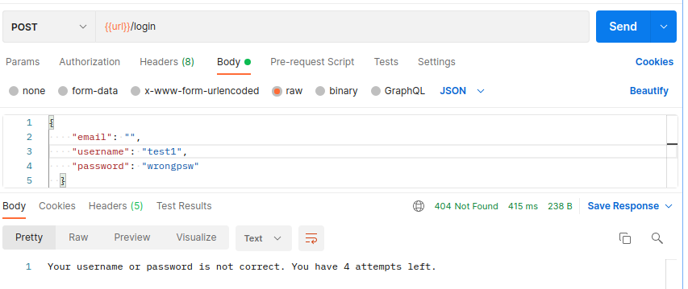

**LogIn API**
----
Account will be locked out for 15 minutes after exceeding 5 consecutive unsuccessful login attempts to block brute-force attacks.


***HTTP Requests***

* ### `/login` ```POST```
    * Response Code: 403
        * Request Body:
      ```yaml
            {
              "email": "",
              "username": "test1",
              "password": "wrongpsw"
            }
      ```
        * Response Body:
      ```yaml
            "Your account has been locked. There are n minutes left to be unlocked."
      ```
        * Description: <br /> The user has been locked, return error message the remaining time to be unlocked.
        * Image: 
    * Response Code: 404
        * Request Body:
      ```yaml
            {
              "email": "",
              "username": "test1",
              "password": "wrongpsw"
            }
      ```
        * Response Body:
      ```yaml
            "The username/email or password is not correct. You have x times attempts"
      ```
        * Description: <br /> Username/email is correct, but the password is wrong, return error message to show how many attempts left.
        * Image: 
    * Response Code: 404
        * Request Body:
      ```yaml
            {
              "email": "",
              "username": "test",
              "password": "wrongpsw"
            }
      ```
        * Response Body:
      ```yaml
            "The username/email or password is not correct."
      ```
        * Description: <br /> User does not exist with given username/email, return error message.
        * Image: 
    * Response Code: 400
        * Request Body:
      ```yaml
            {
              "email": "",
              "username": "test1",
              "password": ""
            }
      ```
        * Response Body:
      ```yaml
            "The password cannot be empty"
      ```
        * Description: <br /> Username/email or password is empty, return error message.
        * Image: 
    * Response Code: 200
        * Request Body: 
      ```yaml
            {
              "email": "",
              "username": "test1",
              "password": "test1psw"
            }
      ```
        * Response Body:
      ```yaml
            {
              "id": 1,
              "email": "test1@gmail.com",
              "username": "test1",
              "password": "test1psw"
            }
      ```
        * Description: <br /> Username/email and password are matched, return all data of the user.
        * Image: 

* ### `/get-all-users` ```GET```
    * Response Code: 200
        * Request Body: N/A
        * Response Body:
      ```yaml
        [
            {
              "id": 1,
              "email": "test1@gmail.com",
              "username": "test1",
              "password": "test1psw"
            },
            ...
        ]
      ```
        * Description: get all users for testing `/login`
        * Image: 


|URL|HTTP Method|Request Body|Response Code|Response Body|Comments|Image|
|----|-----|-----|-----|-----|-----|-----|
|`/get-all-users`|GET|N/A|200|`[{ id: 1, email: "test1@gmail.com", username: "test1", password: "test1psw"}, ...]`| get all users for testing `/login`||
|`/login`|POST|`{email: "", username: "test1", password: "test1psw"}`|200|`{ id: 1, email: "test1@gmail.com", username: "test1", password: "test1psw"}`|username/email and password are matched, return all data of the user||
|`/login`|POST|`{email: "", username: "test1", password: ""}`|400|"The password cannot be empty"|username/email or password is empty, return error message||
|`/login`|POST|`{email: "", username: "test", password: "wrongpsw"}`|404|"The username/email or password is not correct."|user does not exist with given username/email||
|`/login`|POST|`{email: "", username: "test1", password: "wrongpsw"}`|404|"The username/email or password is not correct. You have `x` times attempts"|username/email is correct, but the password is wrong. Alert the user.||
|`/login`|POST|`{email: "", username: "test1", password: "wrongpsw"}`|403|"Your account has been locked. There are `n` minutes left to be unlocked."|the user has been locked. Show the remaining time to be unlocked||

***Unit Tests***

